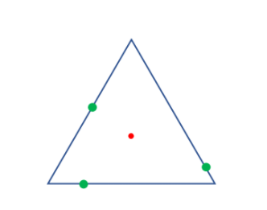
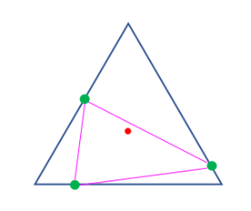
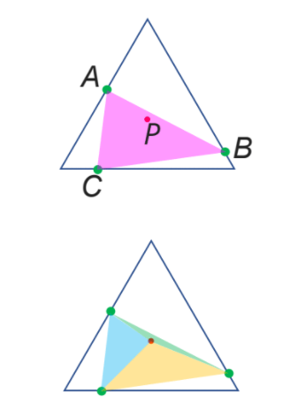
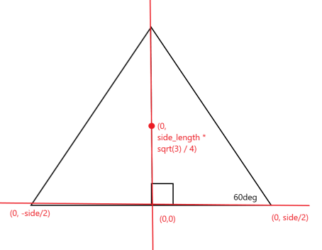
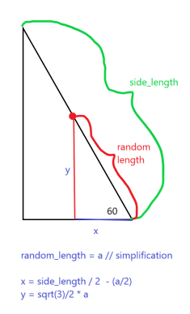

# Quick Extra Credit Monte Carlo Problem

## The problem
(Images 1-3 were provided by Professor Keogh in the question)

Imagine you were to create an equilateral triangle and pick a point randomly on each edge. (image 1)
What is the probability that the point in the center of the large triangle is within the sub-triangle created by the three random points. (image 2)

1
 
 
 2  
 
 
 ## Answer
 I got roughly 41%, although my intuition suggests that this is probably wrong and the answer should be higher. Perhaps ~70%.  After checking a couple of individual runs however my algorithm seems to be working, there may be some small computational error somewhere which I haven't been able to find. I also ran through my trig a couple of times
 and can't seem to find any logical errors.
 
 
 ## Process
 If the sum of the areas of the each subset of 2 points + the center point is equal to the sum of the triangle created by 3 random points (2), then the two triangles are the same and
 the center point is within the sub-triangle. 
 
 3  
 
I use the Monte Carlo method to solve this, simply picking 3 random points N times and for each N run, tallying whether the center is in the sub-triangle.

 In my code, you can set an arbitrary side_length, this will be the unit length of each side of the triangle:  
 <code>double side_length = 100;</code> (line 57)
 
 You also set the number of times the for loop runs:  
 <code>int NUM_RUNS = 10000;</code> (line 56)
 
 Methods I created: <code>double distance_between_two_points(double x1, double y1, double x2, double y2)</code>, <code>double herons(double x1, double y1, double x2, double y2, double x3, double y3)</code>
 and <code>bool is_intriangle(double a, double b, double c, double side_length)</code> 
 
 I figured it would be easiest to approach the problem geometrically, from 3 random side lengths between 0 and side_length.  
  You can create 3 sets of coordinates with simple trig from a 30/60/90 triangle. 
 
  I plot my theoretical equilateral triangle along the x axis with the center in the middle. This puts the center of the triangle at coordinates (0, sqrt(3)/4)
    
 
  Finally, I create my set of coordinates using simple trig like so:
   
  
    then I feed the coordinates into the distance method to get the length of the sub triangles sides, the length of the sub triangles sides are used in heron's formula
  to compute the area. 
  
    I'm sure there is an even easier way to do this with less code but this was my attempt
 
 
 
